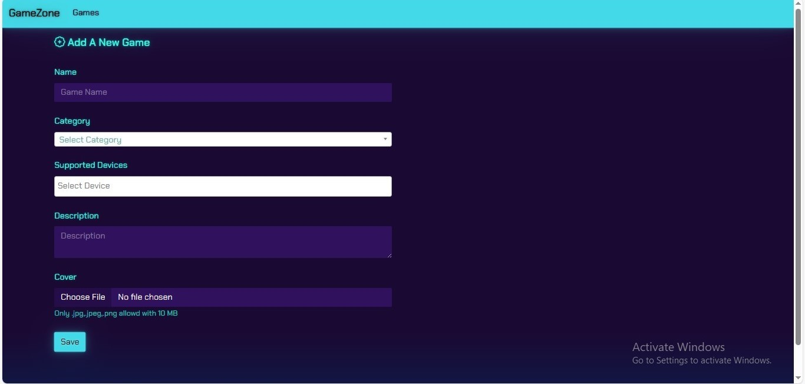
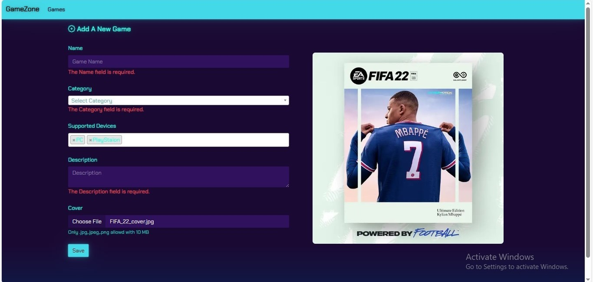
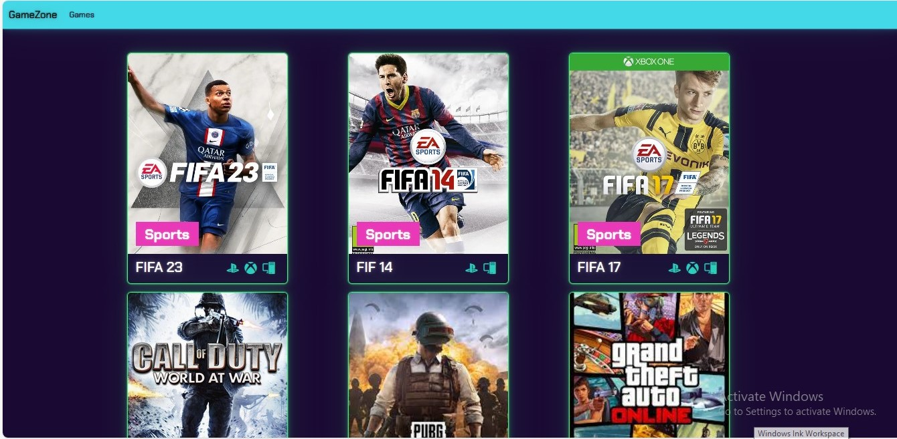
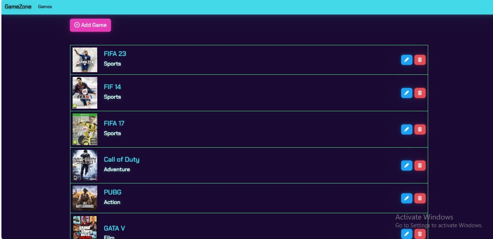
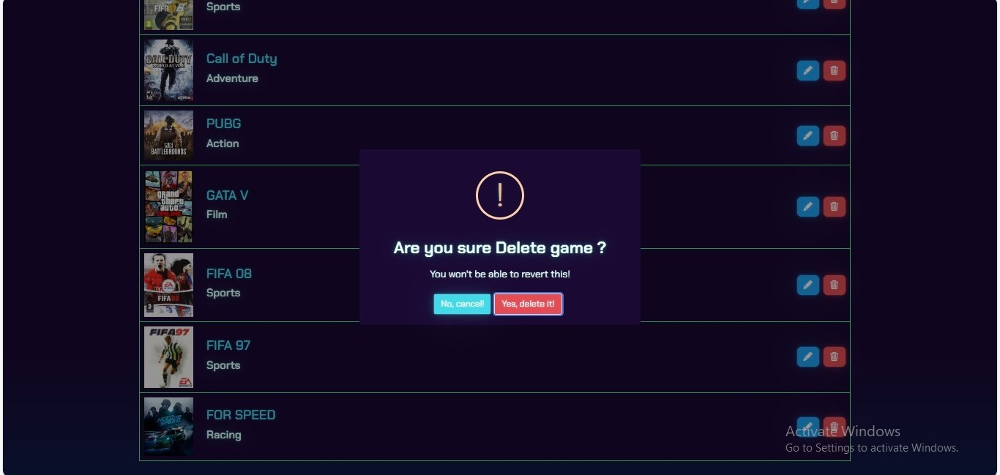

# FIFA Store  

<h2>
ASP.NET Core MVC CRUD Project with Full Validation
</h2>

Project Overview: 
This repository contains a fully functional ASP.NET Core MVC project implementing CRUD (Create, Read, Update, Delete) operations with comprehensive input validation. The project is developed using the latest ASP.NET Core framework, providing a solid foundation for building scalable and maintainable web applications.

## Key Features:
<ul>
 <li> <strong> CRUD Operations:</strong> Complete set of endpoints for managing entities through Create, Read, Update, and Delete operations.</li>
<li><strong>Validation:</strong> Robust server-side and client-side validation mechanisms ensure data integrity and enhance user experience.</li>
<li><strong>Entity Framework Core:</strong> Integration with Entity Framework Core for seamless database interactions and migrations.</li>
 <li><strong>Dependency Injection:</strong> Utilizes ASP.NET Core's built-in dependency injection for scalable and maintainable code.</li>
<li><strong>Responsive Design:</strong> The user interface is designed with responsiveness in mind, ensuring a consistent and enjoyable experience across devices.</li>
 <li><strong>Bootstrap Integration:</strong> Responsive and user-friendly design with Bootstrap for a modern look and feel.</li>
</ul>

## Technologies Used:
<ul>
 <li><strong>ASP.NET Core MVC:</strong> The core framework for building web applications.</li>
 <li><strong>Entity Framework Core:</strong> An ORM (Object-Relational Mapper) for database interaction.</li>
 <li><strong>Bootstrap:</strong> A popular CSS framework for responsive and mobile-first design.</li>
</ul>

## Project Structure:
<ul>
 <li><strong>Controllers: :</strong> Handles incoming HTTP requests, implements CRUD operations.</li>
 <li><strong>Views:</strong> Razor views for rendering HTML and UI components.</li>
 <li><strong>Models:</strong> Defines data models and entities used in the application.</li>
  <li><strong>Data:</strong> Contains the database context and migration configurations.</li>
  <li><strong>wwwroot:</strong> Static files such as stylesheets, scripts, and images.</li>
</ul>

## Screens it contains:

=> Home Page(index)

=> Add Form

=> Edit Form

=> Games List

=> Game Detail

=> Alert confirmation

=> Bottom Navigation Bar 

Now it contains all the screen, thanks for your love and support 🙏 

## Photos
 <strong>Add New Game Form</strong>
  

 <strong> Validation !</strong>
   

 <strong> Home Page </stromg>
   

 <strong> Games List Control </strong>
   

 <strong> Alert confirmation</strong>
   

